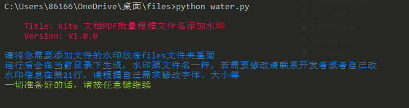

# kiteWaterPDF

kiteWaterPDF：[tongda-kite](https://github.com/kitezzzGrim/tongda-exp)


`自动、批量、根据文件名生成水印，同时给PDF添加水印的脚本`


用法：

```py
pip install -r requirements.txt # 安装需要的模块

python kitewarer.py  # python3
```




默认效果图：


字体类型修改处在第21行。

